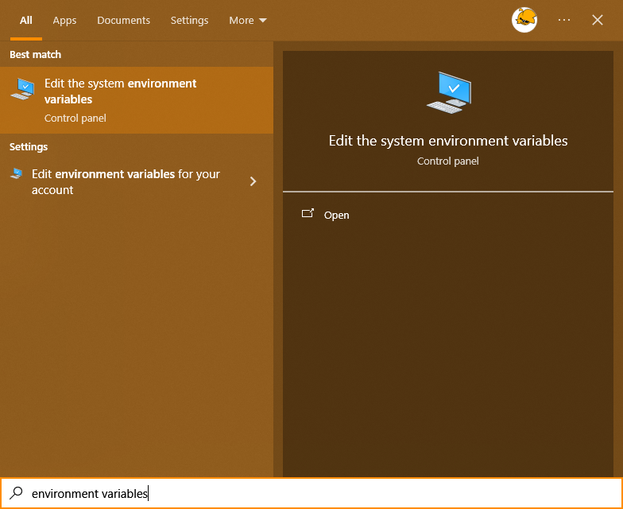

# Adding Python to your PATH Post-Install

If you cant use the setup script because of `"pip" not found` then you need to add Python to your path

> (This requires Admin Privilages)

1. Find the system environment variables 

2. Open environment variables 

3. find `Path` and click edit 

4. If it's not there add it with the correct Python path ([The actual path may be different based on how you installed it, and what version it is](https://stackoverflow.com/questions/647515/how-can-i-find-where-python-is-installed-on-windows) ) 