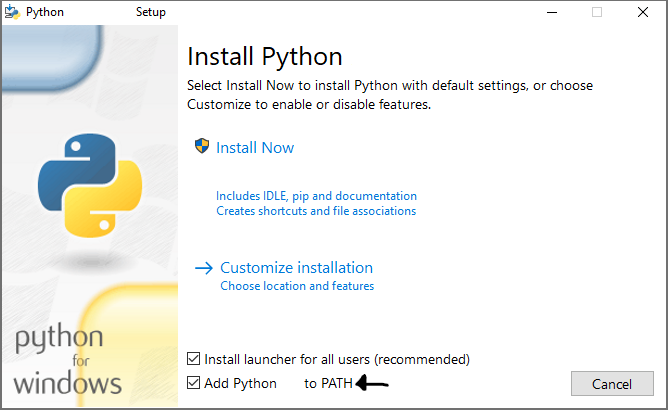

# Krill you bot - A Wacky simple Discord bot for krilling your friends!

### Usage ([My Discord Bot](https://discord.com/oauth2/authorize?client_id=1262532595770589214&permissions=292057852928&integration_type=0&scope=bot))

See [The Readme](discord_readme.md)

### In case the bot goes offline contact: @annyconducter on Discord.

# Usage

Launch the krillyou.exe thats generated by pyinstaller along with an accompanying `botKey.text` in the same folder as the EXE with a [VALID BOTKEY](https://discord.com/developers/docs/quick-start/getting-started)
like `XXXxxXXXXXXXXXXXxxxxxxxxXXXXXXXXX.xxxxxxxXXxxxXXXXXXXxxxxxxxXXXXxxXXxxxx` (why tf would i give you MY botkey lmao)

# Compiling:

you need the [latest version of Python (Python 3.12.4 as of writing this)](https://www.python.org/downloads/) and 3 libraries Found in [Setup.bat](setup.bat)

MAKE SURE TO SET THIS WHEN YOU INSTALL PYTHON!! 

then simply run `build.bat` from the root of the repo with everything downloaded.

# Randomly common issues:

For some reason it'll occasionally fail to create a logs folder and crash, just simple make a logs folder where you put the EXE and it'll stop crashing as long as the main requirement of having a valid bot key is satisfied.